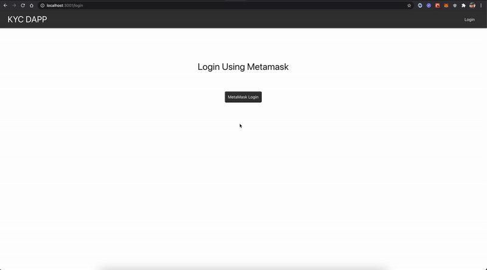
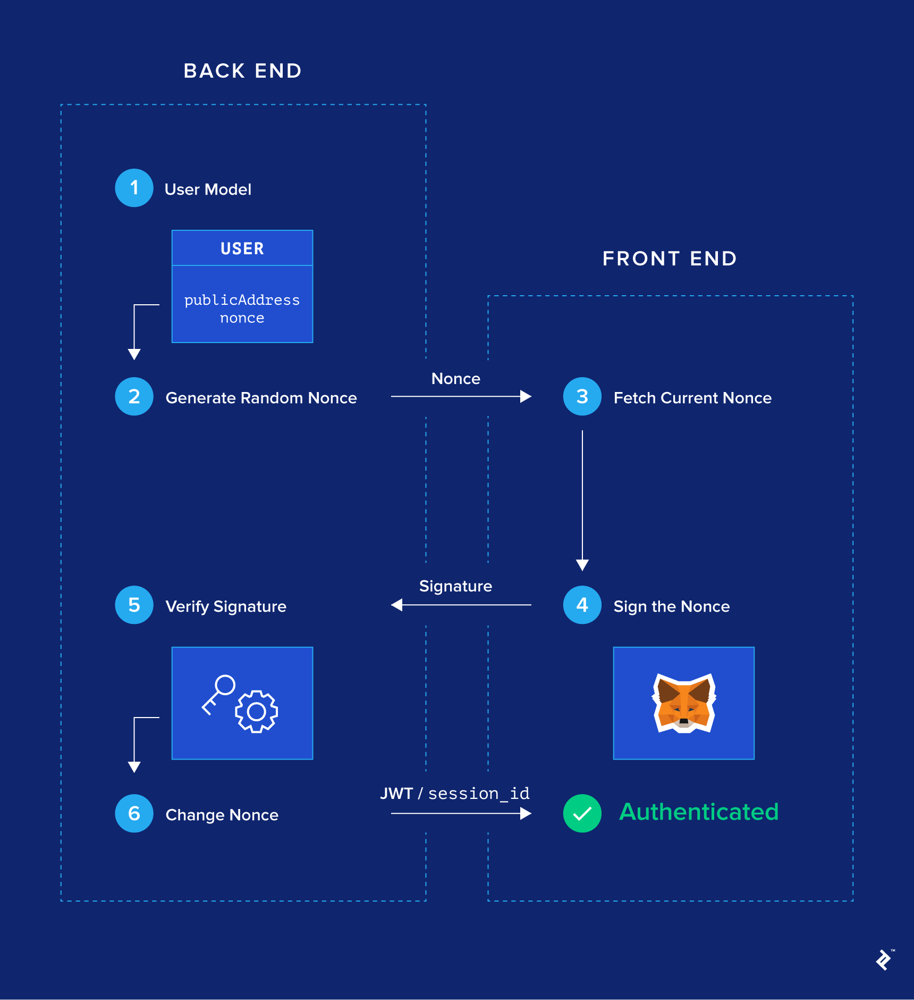

# Decentralized KYC

A decentralized KYC DApp where banks come together and join the consortium blockchain network to ease the process of KYC. The application is based on the private ethereum network. The entities for this network will include the government monitory board and the banks who can raise the request to join the network. 
Currently every bank has their own KYC process setup and customers need to do the KYC again and again for each bank. Also, banks can approve the customer's KYC request even if it doesn't satisy the underlying conditions. 
So, this blockchain based solution brings the ability for banks to vote other banks and customer's KYC requests so that the information can furter be used by any other bank in the network for which the customer has raised the request. Further, the monitory board (eg: RBI for India) who is also part of the network can monitor the bank records and has ability to remove the fraudlent banks based on their activities.

#### KYC DApp Features

1. One click authentication with Metamask. 
2. Role based authorization.
3. Admin can verify banks and add it to the network.
4. Banks can upvote other banks. Based on the votes, the bank rating is being calculated.
5. Bank can add the customer KYC request and can process it further for verification by other banks if and only if othe rating of the bank is more than 50%.
6. Banks can verify the data of the customer and up-vote the verification request raised by other banks. 
7. Customer's KYC request is considered as valid if the customer request's rating is more than 50%.

#### How authentication works?
##### Authentication demo


##### Authentication flow

*Credits - Toptal*
1. Login flow initiates by generating one time nounce from the backend and storing the public address to nonce pair in cache.
2. User intracts with Metamask to sign this once time nounce. Metamask uses the user's public key and sings the nounce.
3. The signature generated using metamask is then send to the backend to verify the signature. 
4. Over the backend, given the signature from the front-end and the nounce stored in cache in the step 1, the signature is verified using the elliptic curve digital signature algorithm giving back the public address of the user.
5. The required authentication is done using the retrieved public address and a jwt token is being generated.
6. Once the user is authenticated, the nounce for that user is updated for security reasons as it should not be reused to sign the transaction again.

Note- For this demonstration purpose an in-memory LRU cache was used as there was just 1 instance of the service. For scaling purpose it is recomended to use a distributed caching.

#### Running the DApp locally 

##### Prerequisite

1. Truffle
2. Ganache GUI application
2. Metamask plugin

##### Steps 
1. Run the Ganache application. Create a new workspace with the following configuration -
    > Truffle Projects  : ```./truffle.config```. Enter the absolute path here. 
    > Host: 127.0.0.1    
    > port: 8545,            
    > network_id: 2020 
    > Gas price: 20000000000 wei (approx)
2. Compile and deploy the smart contract. 
    ```sh
    truffle deploy --reset
    ```
3. Look out for the kyc contract address from the logs above. Update the following address in constants file available at this location ```./app/constant.js```
4. In the same file update the admin address. Choose any one account and use its public address as the admin account.
5. Also, update the *userList* by the public addresses that you will be using as banks for testing.
6. Start the nodejs application located at ```./app ``` using command. Need to install node modules for the first time.
    ```sh
    npm run start
    ```
7. Start the react client application located at ```./client```. Need to install node modules for the first time.
    ```sh
    npm run start
    ```
8. The react application will run at ```http://localhost:3001/```
9. Connect to new custom RPC in the Metamask plugin with the configurations same as that used for ganache.(one time setup).
10. Now, all parts of application is up and running and one should be able to use the kyc dapp.
